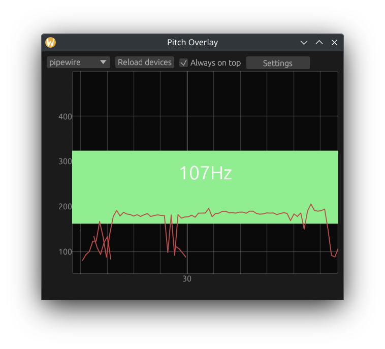

# Pitch Overlay
A simple little application that shows you the current pitch of your microphone input.
Useful if you are doing voice training and want to keep an eye on your pitch while doing other stuff like talking to friends online.

## Screenshots

## Install
1. Download the release for your operating system and the CREPE model file from the [releases tab](TODO).
2. Extract the ZIP somewhere and copy the model file into the folder. Make sure it is in the same directory as the executable itself.

## Known issues
- [ ] If your microphone does not natively output 16 kHz audio, you are not able to select it as an input source (seems to affect mostly Windows in my limited testing) 
- [ ] The UI is very rough around the edges
- [ ] Always-on-top does not work on some OSes/desktop environments (Wayland being one of them)
- [ ] Pitch estimation is not really tested yet and (although it looks correct) might be somewhat off
- [ ] Pitch is not being averaged, meaning that it jumps around a lot 

## How it works
Pitch estimation is a non-trivial problem.
[CREPE](https://github.com/marl/crepe) is a neural network implemented in Python using TensorFlow that can estimate the pitch of voices.
This repository contains a port of only the relevant Python code to Rust, everything not needed for the exact model used is left out.
The used model belongs to the respective authors.